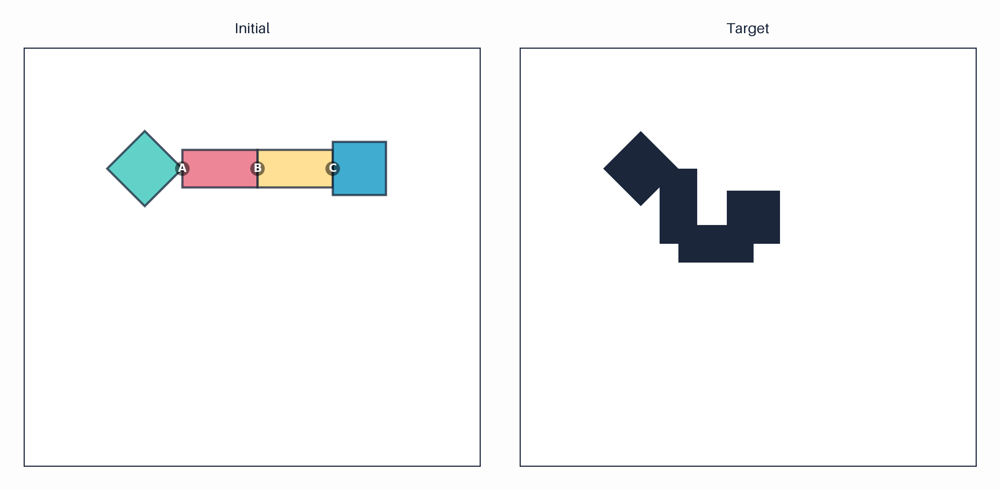

# Hinge Folding Puzzle Generator

Generate hinge folding puzzles where a chain of shapes connected by labeled hinges must be folded to form a target shape.

## Overview

This generator creates visual reasoning puzzles where:
- A chain of 2-5 shapes are connected by labeled hinges (A, B, C, ...)
- Each hinge can be rotated by a specific angle (typically 90° or 180°)
- The task is to determine the rotation sequence to transform the chain into a target shape
- Similar to tangram but uses rotation instead of translation

### Example Puzzle



*Example puzzle showing the initial configuration (left) with labeled hinges A, B, C and the target folded shape (right). The task is to determine the rotation angle for each hinge.*

## Quick Start

Generate per-level datasets (50 samples each):

```bash
# Level 1: 2 pieces = 1 hinge (1 CoT step)
uv run main.py --instances 50 --min-pieces 2 --max-pieces 2 --output-dir output/level_01 --seed 42

# Level 2: 3 pieces = 2 hinges (2 CoT steps)
uv run main.py --instances 50 --min-pieces 3 --max-pieces 3 --output-dir output/level_02 --seed 142

# Level 3: 4 pieces = 3 hinges (3 CoT steps)
uv run main.py --instances 50 --min-pieces 4 --max-pieces 4 --output-dir output/level_03 --seed 242

# Level 4: 5 pieces = 4 hinges (4 CoT steps)
uv run main.py --instances 50 --min-pieces 5 --max-pieces 5 --output-dir output/level_04 --seed 342

# Or use the repository-wide generation script:
cd .. && ./generate_all_datasets.sh --task hinge-folding
```

This will create an `output/` directory with puzzles organized as:

```
output/
├── dataset_index.json          # Overall dataset info
├── hf_000001/
│   ├── initial.png             # Initial chain configuration with labeled hinges
│   ├── target.png              # Target folded shape
│   ├── cot_00.png              # Chain-of-thought: first rotation
│   ├── cot_01.png              # Chain-of-thought: second rotation
│   ├── cot_XX.png              # ... (one per hinge)
│   └── metadata.json           # Puzzle-specific metadata
├── hf_000002/
│   └── ...
...
```

## Usage

### Basic Generation

```bash
# Generate with defaults (7000 puzzles, 2-5 pieces)
uv run main.py

# Generate more instances
uv run main.py --instances 10000

# Control piece complexity
uv run main.py --min-pieces 3 --max-pieces 6

# Specify output directory
uv run main.py --output-dir my_puzzles

# Set random seed for reproducibility
uv run main.py --seed 123
```

### Command-Line Options

| Option | Type | Default | Description |
|--------|------|---------|-------------|
| `--instances` | int | 7000 | Number of puzzles to generate |
| `--min-pieces` | int | 2 | Minimum number of pieces per puzzle |
| `--max-pieces` | int | 5 | Maximum number of pieces per puzzle |
| `--output-dir` | str | output/dataset | Output directory path |
| `--seed` | int | 42 | Random seed for reproducibility |

## Difficulty Levels

The complexity of hinge folding puzzles is controlled by the **number of pieces** (and thus hinges). Each hinge rotation = 1 CoT step:

| Level | Pieces | Hinges | CoT Steps | Output Directory |
|-------|--------|--------|-----------|------------------|
| **1** | 2 | 1 | 1 | `output/level_01` |
| **2** | 3 | 2 | 2 | `output/level_02` |
| **3** | 4 | 3 | 3 | `output/level_03` |
| **4** | 5 | 4 | 4 | `output/level_04` |
| **5** | 6 | 5 | 5 | `output/level_05` |

More hinges = more rotations to track = more complex spatial reasoning required.

## How It Works

### 1. Initial Configuration

The generator creates a chain of 2-5 pieces arranged in a straight line, connected by labeled hinges (A, B, C, ...). Each piece is independently and randomly selected from four shape types: **square**, **diamond**, **triangle**, or **rectangle**.

### 2. Rotation Solution

Each hinge is assigned a random rotation angle from **{0°, 90°, 180°, 270°}** (anti-clockwise). The generator uses rejection sampling to ensure that the final folded configuration has good visibility (no piece is more than 80% overlapped by others).

### 3. Chain-of-Thought Visualization

The puzzle includes progressive folding images showing how the chain transforms step-by-step as each hinge is rotated.

### 4. Visualization

Multiple visualizations are generated:

- **Initial** (`initial.png`): Chain configuration with labeled hinges (A, B, C, ...)
- **Target** (`target.png`): Final folded shape
- **Chain-of-Thought** (`cot_XX.png`): Progressive folding sequence showing each rotation step

## Output Format

### Dataset Index (`dataset_index.json`)

```json
{
  "total_samples": 7000,
  "min_pieces": 2,
  "max_pieces": 5,
  "samples": [...]
}
```

### Puzzle Metadata (`puzzle_XXXX/metadata.json`)

```json
{
  "num_pieces": 4,
  "num_hinges": 3,
  "shape_chain": ["square", "rectangle", "rectangle", "diamond"],
  "rotation_angles": [90, 90, 270],
  "rotation_steps": [
    {"hinge_id": "A", "angle": 90},
    {"hinge_id": "B", "angle": 90},
    {"hinge_id": "C", "angle": 270}
  ],
  "rotation_sequence": "A 90, B 90, C 270",
  "piece_colors": ["#2EC4B6", "#E85D75", "#FFD670", "#0090C1"],
  "initial_image": "initial.png",
  "target_image": "target.png",
  "combined_image": "combined.png",
  "cot_images": ["cot_00.png", "cot_01.png", "cot_02.png"],
  "puzzle_id": "puzzle_0001"
}
```

## Example Question Format

```
Given: A chain of shapes connected by labeled hinges A, B, C (see initial.png)
Target: The folded configuration (see target.png)

Question: What rotation angles (in degrees) should be applied to each hinge 
          to transform the initial configuration into the target shape?

Answer Format: hinge_label angle, hinge_label angle, ...
Example Answer: A 90, B 90, C 270
```

### Visual Chain-of-Thought

Each puzzle includes a visual chain-of-thought showing the folding process:

1. **Step 0** (`cot_00.png`): After rotating hinge A
2. **Step 1** (`cot_01.png`): After rotating hinges A and B
3. **Step N** (`cot_NN.png`): After all rotations (matches target)

This helps understand how each rotation contributes to forming the target shape.

## Dependencies

- `matplotlib>=3.10.6` - Rendering
- `numpy>=2.3.3` - Numerical operations
- `pillow>=11.3.0` - Image manipulation
- `tqdm>=4.66.0` - Progress bars

All dependencies are managed via `uv` and specified in `pyproject.toml`.

## Shape Types

The generator supports four base shapes:

1. **Square** - Regular square with 90° corners
2. **Diamond** - Square rotated 45°
3. **Triangle** - Equilateral triangle
4. **Rectangle** - Rectangular shape with 2:1 aspect ratio

## Notes

- Hinges are labeled sequentially from left to right (A, B, C, ...)
- All rotations are anti-clockwise (positive angle direction)
- Rotation angles are multiples of 90° (0°, 90°, 180°, 270°)
- The first piece in the chain remains fixed
- Each subsequent piece rotates around the hinge connecting it to the previous piece
- Rejection sampling ensures the final configuration has good visibility (no piece >70% occluded)
- Images maintain consistent scale and style

