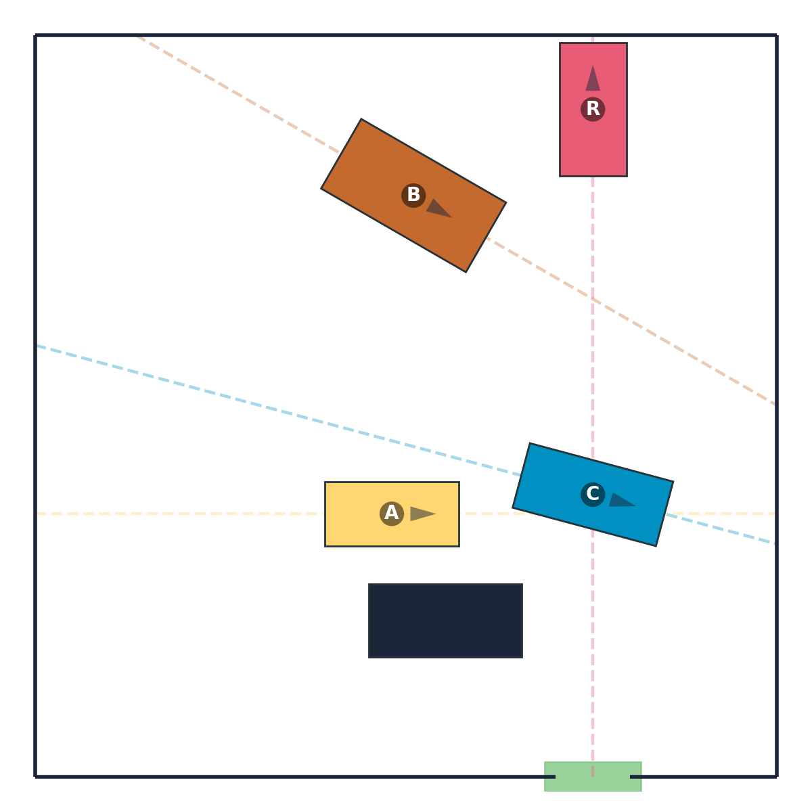

# Rush Hour Variant: Visual Reasoning Benchmark

This benchmark extends the <a href="https://en.wikipedia.org/wiki/Rush_Hour_(puzzle)">Rush Hour</a> puzzle to defeat ASCII shortcuts and require true visual manipulation. We replace strictly axis-aligned rectangular cars on a grid with richer, physically plausible objects that translate along fixed local axes and are initialized at non-axis-aligned orientations, increasing the need for mental imagery and multi-step visual reasoning.

### Example Puzzle



*Example puzzle showing vehicles in a parking lot. The red car (R) must reach the green exit by moving other vehicles out of the way. Each vehicle can only move forward or backward along its axis.*

## What the task is

At a high level, the puzzle is to clear a path so the red car can reach an exit. Each vehicle (car or lorry/truck) is constrained to move only by translating forward or backward along its own local axis; rotations are not allowed. To make the reasoning requirements explicit, the benchmark renders each vehicle’s allowable drive direction as a thin "rail" overlay and, in the visual chain-of-thought, plots the actual path the red car traverses as it heads to the exit.

## Chosen Design

- Non-rectangular polygonal shapes (rectangles, L/T, triangles, general polygons)
- Fixed orientations: each movable object has an initial orientation (possibly non-axis-aligned) and keeps it
- Discrete translations only: move forward/backward along the object’s local axis until the object reaches another obstacle
- No rotations, no curved paths
- Continuous geometry with exact polygon collision checks (prevents ASCII shortcuts)

## Design Goals

- Require multi-step, goal-oriented manipulation of visual states
- Prevent ASCII-art solutions by using non-grid, non-rectangular geometry and rotations
- Provide intermediate visual chain-of-thought (CoT) states
- Support multiple question types beyond solvable/unsolvable

## World Model (v0 decisions)

- 2D workspace with continuous coordinates; bounded rectangular board with one exit.
- Obstacles: static rectangular shapes. These correspond to houses and greenery in the original puzzle.
- Movable objects: rigid polygons (rectangle cars, elongated trucks); each has a fixed orientation, which is clearly indicated in the puzzle.
- Motion model (discrete):
  - Translate only along the object’s local axis (forward/backward) until the object hits another obstacle
  - No rotations; orientation is immutable after initialization
  - No interpenetration with other objects or walls (exact polygon collision checks)
  - No curved motions
- Target piece: a red car (polygonal rigid body) must reach an exit region (overlap threshold).

## Instance Generation (High Level)

The instance generation should be constructive, since this is easier than sampling a puzzle with a controllable difficulty.

### Different Difficulties
We propose to test benchmark in 5 different difficulties:

1. In the easiest difficulty the puzzle consists of the red car and the exit. The model only has to infer whether the red car has to be moved forward or backward to reach the exit.
2. In this difficulty there is one distractor car placed between the red car and the exit. Before moving the red car towards the exit, the model first has to move this distractor car out of the way. The blocker car should of course not be placed in parallel with the red car (since then the instance would not be solvable) but it does not need to be perpendicular to the red car (to ensure non-ASCII-ability).
3. This difficulty introduces other distractor cars and obstacles, which might restrict the blocker car to only be able to move in one direction to clear the path.
4. For this difficulty stage, we introduce two blocker cars on the path between the red car and the exit. Both blocker cars have to be moved out of the way for before the red car can reach the exit. This stage also includes other distractor cars and obstacles. This is the final difficulty of the benchmark. This difficulty also oftentimes requires to move multiple cars out of the way.

## Evaluation

Evaluate whether the model can correctly guide the red car towards the exit by chaining actions of the form "B forward; C backward; R forward"

## Output Format

```
output/
├── level_01/                       # Difficulty level 1
│   ├── level_metadata.json         # Level-specific metadata
│   ├── puzzle_0001/
│   │   ├── initial.png             # Initial puzzle state
│   │   ├── cot_00.png              # Chain-of-thought step 1
│   │   ├── cot_01.png              # Chain-of-thought step 2 (if needed)
│   │   ├── text_description.txt    # Text description of the puzzle
│   │   └── metadata.json           # Puzzle metadata
│   ├── puzzle_0002/
│   │   └── ...
│   └── ...
├── level_02/                       # Difficulty level 2
│   └── ...
└── ...
```

### metadata.json (per puzzle)

```json
{
  "puzzle_id": 1,
  "level": 1,
  "num_cot_images": 2,
  "num_actions": 2,
  "seed": 42,
  "initial_state_image": "initial.png",
  "cot_images": ["cot_00.png", "cot_01.png"],
  "board": {"width": 10.0, "height": 10.0, "exits": [...]},
  "objects": [
    {"id": "red_car", "shape": "rectangle", "size": [1.8, 0.9], "pose": {...}, "local_axis": [...], "movable": true},
    ...
  ],
  "actions": [
    {"object_id": "A", "direction": 1, "distance": 2.5},
    {"object_id": "red_car", "direction": -1, "distance": 8.1}
  ],
  "solution_length": 2
}
```

## Visual Chain-of-Thought (CoT)

- Each step shows the result of a single atomic action (push-until-collision translation along a local axis)
- Steps visualize contact, clearances, and unlocked regions (e.g., gates turning green)
- Per-vehicle drive rails are drawn to make each piece’s allowable motion explicit; when relevant, the red car’s cumulative path toward the exit is plotted across steps.
- Final CoT matches the optimal (or reference) solution path

## Evaluation Protocol

### Action Interface (for sequence evaluation)

- Action token: `<object_id><dir>` with `dir ∈ {+, −}` for forward/backward along the object’s local axis.
- Execution semantics: push-until-collision; move continuously until touching wall/another object (or exit for red car). Zero-motion tokens count as no-ops.
- Per-instance budget `L_budget`; early stop on solve.

### Metrics

- Final answer accuracy (per question type)
  - Critical Object Identification: fraction of instances where the selected object matches the labeled critical object (see Progress Criterion below)
  - Action Sequencing (1–2 steps): fraction of instances where the predicted first (or first-two) action(s) exactly match the unique reference sequence
- CoT alignment
  - Frame-level similarity between predicted intermediate states and reference CoT (LPIPS/SSIM on renders)
  - Step-level action agreement (edit distance between predicted and reference action sequences)
- Step efficiency
  - Excess steps over optimal (if optimal known) or over reference (reverse-scramble plan)
- Robustness to distractors
  - Accuracy against curated distractor sets (near-miss geometry, suboptimal detours, dead-end prefixes)

### Progress Criterion (for labeling “critical object” and early steps)

- Corridor-based progress (P2): predefined spline corridor from red car to exit; the blocking set is the set of objects intersecting a buffered corridor.
  - A move achieves progress if it strictly reduces the blocking set size.
- Heuristic drop (P1) tie-breaker: A* heuristic (distance-to-exit via distance transform) must strictly decrease if P2 ties occur.

### Acceptance Rules

- Action Sequencing: keep instances where a unique best first action exists (by progress criterion + heuristic tie-break). For 2-step sequences, require a unique best pair within depth-2.
- If uniqueness fails, regenerate or switch to a different question type for that instance.

### Canonicalization and Ties

- Canonical solution stored as `canonical_actions` (push-until-collision tokens) from shortest-path search.
- Optionally include `equivalence_classes` for commuting adjacent tokens; otherwise, enforce lexicographic tie-break by `(object_id, dir)`.

## Difficulty Levels

The complexity of Rush Hour puzzles is controlled by the **number of CoT images** (intermediate steps). Each action produces one CoT image showing the state after that move:

| Level | CoT Images | Actions | Output Directory | Description |
|-------|------------|---------|------------------|-------------|
| **1** | 1 | 1 | `output/level_01` | Just move red car to exit |
| **2** | 2 | 2 | `output/level_02` | Move 1 blocker + red car |
| **3** | 3 | 3 | `output/level_03` | Move 2 blockers + red car |
| **4** | 4 | 4 | `output/level_04` | Complex multi-blocker |
| **5** | 5 | 5 | `output/level_05` | Extended planning |

**Note**: Level = number of CoT images = number of actions. Each action produces one intermediate state image showing the result of that move.

More CoT images = more blockers to clear = more complex spatial reasoning required.

## Usage

### Generate Per-Level Datasets

```bash
# Generate all levels (1-5), 50 instances each
uv run main.py --instances 50 --seed 42

# Generate specific level only
uv run main.py --instances 50 --level 3 --output-dir output/level_03 --seed 42

# Generate custom range of levels
uv run main.py --instances 50 --min-level 2 --max-level 4 --seed 42

# Or use the repository-wide generation script:
cd .. && ./generate_all_datasets.sh --task rushhour
```

### Command-Line Options

| Option | Type | Default | Description |
|--------|------|---------|-------------|
| `--instances` | int | 50 | Instances per level |
| `--seed` | int | 42 | Base random seed |
| `--level` | int | None | Generate only this specific level |
| `--min-level` | int | 1 | Minimum level (when not using --level) |
| `--max-level` | int | 5 | Maximum level (when not using --level) |
| `--max-attempts` | int | 5000 | Max generation attempts per level |
| `--output-dir` | str | output | Base output directory |

This file is a living document; we will refine as we prototype.


