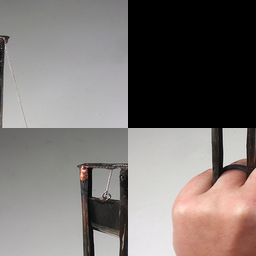
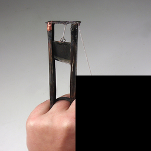

# Sliding Puzzle Generator

Generate sliding tile puzzles where a scrambled image must be reconstructed through sequential tile movements.

## Overview

This generator creates visual reasoning puzzles where:
- A natural image is divided into an **n×n grid** of tiles
- One tile is replaced by a **blank space** (black)
- Remaining tiles are **randomly permuted** to create a scrambled initial state
- The task is to **reconstruct the original image** through valid tile movements
- Each move swaps the blank with an adjacent tile (up, down, left, right)

### Example Puzzle

| Initial State | Target State |
|:-------------:|:------------:|
|  |  |

*Example puzzle showing the scrambled initial state (left) and the target solved state (right). The task is to find the sequence of moves to transform the initial state into the target.*

## Quick Start

Generate a dataset with default settings:

```bash
uv run main.py
```

This will create an `output/` directory with puzzles organized as:

```
output/
├── dataset_metadata.json          # Overall dataset info
├── puzzle_0001/
│   ├── initial.png                # Scrambled puzzle state
│   ├── target.png                 # Original image (solution)
│   ├── cot_00.png                 # Chain-of-thought: first move
│   ├── cot_01.png                 # Chain-of-thought: second move
│   ├── cot_XX.png                 # ... (one per move in solution)
│   └── metadata.json              # Puzzle-specific metadata
├── puzzle_0002/
│   └── ...
...
```

## Usage

### Per-Level Datasets

```bash
# Set source images directory (ImageNet-1k or similar)
SOURCE_DIR="/path/to/imagenet-1k"

# Generate per-level datasets (50 samples each)
uv run main.py --instances 50 --grid-size 2 --min-moves 1 --max-moves 1 --output-dir output/level_01 --source-images $SOURCE_DIR --seed 42
uv run main.py --instances 50 --grid-size 2 --min-moves 2 --max-moves 2 --output-dir output/level_02 --source-images $SOURCE_DIR --seed 142
uv run main.py --instances 50 --grid-size 2 --min-moves 3 --max-moves 3 --output-dir output/level_03 --source-images $SOURCE_DIR --seed 242
uv run main.py --instances 50 --grid-size 2 --min-moves 4 --max-moves 4 --output-dir output/level_04 --source-images $SOURCE_DIR --seed 342
uv run main.py --instances 50 --grid-size 2 --min-moves 5 --max-moves 5 --output-dir output/level_05 --source-images $SOURCE_DIR --seed 442

# Or use the repository-wide generation script:
export SLIDING_PUZZLE_SOURCE_DIR="/path/to/imagenet-1k"
cd .. && ./generate_all_datasets.sh --task sliding-puzzle
```

### Command-Line Options

| Option | Type | Default | Description |
|--------|------|---------|-------------|
| `--instances` | int | 50 | Number of puzzles to generate |
| `--grid-size` | int | 3 | Size of the grid (n×n) |
| `--min-moves` | int | 5 | Minimum moves to scramble |
| `--max-moves` | int | 15 | Maximum moves to scramble |
| `--output-dir` | str | output | Output directory path |
| `--seed` | int | 42 | Random seed for reproducibility |

## Difficulty Levels

Puzzle difficulty is controlled by the **number of moves** required to solve. Each level corresponds to an exact number of CoT steps:

| Level | Moves | CoT Steps | Grid Size | Output Directory |
|-------|-------|-----------|-----------|------------------|
| **1** | 1 | 1 | 2×2 | `output/level_01` |
| **2** | 2 | 2 | 2×2 | `output/level_02` |
| **3** | 3 | 3 | 2×2 | `output/level_03` |
| **4** | 4 | 4 | 2×2 | `output/level_04` |
| **5** | 5 | 5 | 2×2 | `output/level_05` |

### Why Grid Size Matters

- **2×2**: 3 movable tiles, limited configurations (~12 valid states)
- **3×3**: 8 movable tiles, moderate complexity (~181,440 valid states)
- **4×4**: 15 movable tiles, exponentially harder (~10¹³ valid states)

## How It Works

### 1. Image Selection

A natural image is selected and cropped to a square aspect ratio.

### 2. Grid Division

The image is divided into an n×n grid of tiles:
- Total tiles: n²
- Movable tiles: n² - 1 (one blank space)
- Blank tile: typically bottom-right corner in solved state

### 3. Scrambling

Random valid moves are applied to create the initial scrambled state:
- Move sequence length: random value in [min_moves, max_moves]
- Each move swaps blank with an adjacent tile
- All scrambles are **guaranteed solvable** (maintain permutation parity)

### 4. Solvability Guarantee

The 15-puzzle and its generalizations have a parity constraint:
- Only half of all tile permutations are reachable from the solved state
- Generated puzzles maintain valid parity through:
  - Scrambling via valid moves from solved state, OR
  - Correcting parity violations with a single swap

### 5. Visualization

Multiple visualizations are generated:

- **Initial** (`initial.png`): Scrambled puzzle state
- **Target** (`target.png`): Original image (correct solution)
- **Chain-of-Thought** (`cot_XX.png`): Progressive solution showing each move in reverse

## Output Format

### Dataset Metadata (`dataset_metadata.json`)

```json
{
  "description": "Sliding tile puzzle dataset",
  "total_instances": 50,
  "grid_size": 3,
  "min_moves": 5,
  "max_moves": 15,
  "puzzles": [...]
}
```

### Puzzle Metadata (`puzzle_XXXX/metadata.json`)

```json
{
  "puzzle_id": 1,
  "grid_size": 3,
  "num_moves": 8,
  "moves": ["up", "left", "down", "right", ...],
  "initial_state": [[1, 2, 3], [4, 5, 6], [7, -1, 8]],
  "target_state": [[1, 2, 3], [4, 5, 6], [7, 8, -1]],
  "initial_image": "initial.png",
  "target_image": "target.png",
  "cot_images": ["cot_00.png", "cot_01.png", ..., "cot_07.png"],
  "solution_moves": ["left", "up", "right", ...],
  "is_solvable": true,
  "parity_valid": true
}
```

Note: In the state representation, `-1` denotes the blank tile position.

## Action Space

The agent interacts with the puzzle through four discrete actions:

| Action | Effect | Condition |
|--------|--------|-----------|
| `up` | Swap blank with tile above | Blank not in top row |
| `down` | Swap blank with tile below | Blank not in bottom row |
| `left` | Swap blank with tile to the left | Blank not in leftmost column |
| `right` | Swap blank with tile to the right | Blank not in rightmost column |

Invalid moves (e.g., moving up when blank is in top row) are no-ops or rejected depending on evaluation mode.

## Visual Chain-of-Thought

Each puzzle includes a visual chain-of-thought showing the solution path:

1. **Step 0** (`cot_00.png`): After first move toward solution
2. **Step 1** (`cot_01.png`): After second move
3. **Step N** (`cot_N.png`): Final state (matches target)

The CoT sequence shows the **reverse** of the scrambling moves, providing a reference solution path.

## Computational Complexity

The sliding puzzle problem is **NP-complete** for n×n grids with n ≥ 3:

- **State space size**: O((n²)!)
- **Solution length**: Can be exponential in puzzle size
- **Optimal solving**: Requires extensive search (A*, IDA*)

This makes it an excellent benchmark for testing:
- Multi-step planning
- Mental state tracking
- Goal-oriented action sequencing
- Visual working memory

## Evaluation Metrics

Recommended metrics for model evaluation:

1. **Solution Rate**: Percentage of puzzles solved correctly
2. **Move Efficiency**: Average excess moves beyond optimal solution
3. **Intermediate State Accuracy**: Similarity of predicted CoT to ground truth
4. **Action Validity**: Percentage of legal moves generated
5. **Planning Horizon**: Ability to solve puzzles requiring N-step lookahead

## Example Puzzle

```
Initial State (scrambled):
┌───┬───┬───┐
│ 2 │ 8 │ 3 │
├───┼───┼───┤
│ 1 │ 6 │ 4 │
├───┼───┼───┤
│ 7 │ 5 │   │  ← blank
└───┴───┴───┘

Actions: right, up, left, left, up, right, down, right

Target State (solved):
┌───┬───┬───┐
│ 1 │ 2 │ 3 │
├───┼───┼───┤
│ 4 │ 5 │ 6 │
├───┼───┼───┤
│ 7 │ 8 │   │  ← blank
└───┴───┴───┘
```

## Dependencies

- `pillow` - Image manipulation
- `numpy` - Array operations
- `matplotlib` - Visualization (optional)

All dependencies are managed via `uv` and specified in `pyproject.toml`.

## Technical Details

### State Representation

- **Solved state**: Tiles numbered 1 to n²-1 in row-major order, blank at bottom-right
- **State encoding**: 2D array where -1 represents the blank tile
- **Action encoding**: String tokens ("up", "down", "left", "right")

### Solvability Check

The puzzle uses the **permutation parity invariant**:
- Count inversions in the tile sequence (excluding blank)
- For odd grid sizes: puzzle is solvable if inversions are even
- For even grid sizes: solvability depends on both inversions and blank row position

All generated puzzles are verified to maintain valid parity.

### Scrambling Strategy

Two scrambling methods are supported:

1. **Random walks** (default): Apply random valid moves from solved state
   - Guarantees solvability
   - May create easier-than-expected puzzles (stays near solved state)

2. **Random permutation with parity correction**: 
   - Generate random permutation
   - Check and correct parity if needed
   - Produces uniformly difficult scrambles

## References

- Ratner, D., & Warmuth, M. (1986). Finding a Shortest Solution for the (N×N)-Extension of the 15-Puzzle is Intractable. *AAAI*, 86, 168-172.
- The sliding puzzle is NP-complete for n≥3 (Ratner & Warmuth, 1986)

## Related Benchmarks

See also:
- **Form Board** - Spatial decomposition and assembly
- **Tangram** - Shape composition reasoning
- **Paper Folding** - Transformation tracking

Together, these benchmarks test different aspects of visual mental imagery and spatial reasoning.

